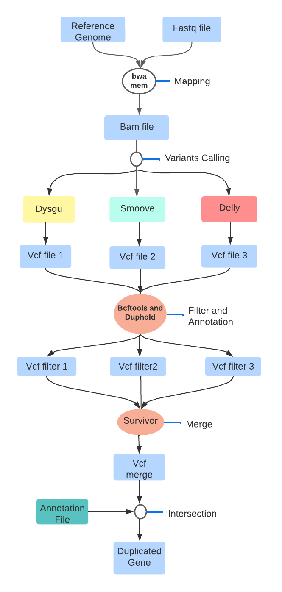

# DUPFinder: Detection tools of Duplicated genes

DUPfinder is a tool to characterize duplicated genes based on the detection of structural variations (CNV) and especially duplications from a sample or a population of samples.

## Table of contents

-[introduction](#introduction)
- [Workflow of Hecaton](#overview)
- [Installation](#install)
  - [Prerequisites](#prerequisites)
  - [Gettind installation](#Getting)
- [Usage](#usage)
  - [Running multiple samples at once](#multiple)


##Introduction

DUPFinder is a tool developed for the detection of gene duplications from next generation sequencing (NGS) data using paired-end Illumina reads. 
It is specifically designed for plant data but can work well with human data with a reference genome and gene annotation file.

The pipeline is built using nextflow, a workflow tool that makes it very easy to run tasks across multiple computational infrastructures. It uses containers like Docker or Singularity or cross-platform package and environment managers like Conda; these make the workflow more reproducible. The Nextflow implementation on this pipeline uses the Conda package manager which easily manages the maintenance and update of the software used by the pipeline as well as the dependencies.


## Workflow of DUPFinder

* Aligning reads to a reference genome using [**bwa mem**]
* Calling CNVs using the structural variant callers **[Delly**], [**Dysgu**] and [**Delly**]
* Post-processing each set of CNVs to keep the duplications and remove false positives [**Duphold**], [**Bcftools**]
* Merging all sets of duplications into one large set [**SURVIVOR**]
* Detection of duplication gene using the annotation file [**Bedtools**]

<p align="center">
    
</p>

## Installation

### Prerequisites

DUPFinder can only be installed on Linux systems and requires Anaconda/Miniconda (Python 3.9+) to be present on the system.

All steps of Hecaton are run using the [`Nextflow`](https://www.nextflow.io/docs/latest/getstarted.html#installation) (`>=22.10`) workflow language.

## Getting Started
## <a name="install"></a>Quick installation using conda 

```bash

#Step 1. Download the dUPFinder :

git clone https://github.com/assane-mbodj/dupfinder

#Step 2. Go to dupfinder folder

cd dupfinder

#Step 3. Find the yaml file in the folder and run :

conda env create -f dupfinder_env.yml

bash install.sh

#Step 4. Activate the environnement dupfinder_env:

conda activate dupfinder_env
```

## Index Reference genome

Before starting, create index file for the reference genome to reduce mapping time using the command following.

```bash

# build index accordingly

bwa index reference.fa 

```
## <a name="Usage"></a>Usage

```
DUPfinder: Tool for detecting duplicate gene using Illumina sequencing data.

  DUPFinder version: v1.0.0
 
    Usage: nextflow run dupfinder.nf --c file.config --genome_file reference.fa --reads "pair_id_{1,2}.fastq" --annot file.bed --out Output_DUPFinder

    Command arguments DUPFinder: The following parameters need to be specified when running DUPFinder
    
	    --genome_file       Reference genome in FASTA format
	    
	    --reads             set of paired-end reads in FASTQ format. Gzipped FASTQ files are allowed
	    
	    --annot             the file containing the gene annotation: it can be in gff or bed format and must be tabulated
	    
	    --out               Output directory to which all results will be written
	    
	    --c                 Config file specifying the number of CPU cores and memory that will be assigned to DUPFinder
	   	    
	   	    
    Optional arguments:
	    -w               Working directory to which intermediate results will be written. Default: work
            -v               version
```

### <a name="multiple"></a>Running multiple samples at once
DUPFinder can be used to run multiple samples using a single command. For exemple if there existe several sample paired-end, they can all be processed using:
```bash
nextflow run dupfinder.nf --c file.config --genome_file reference.fa --reads "*_{1,2}.fastq" --annot file.bed --out Output_DUPFinder
```


