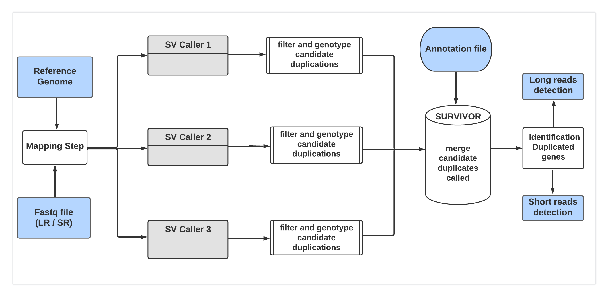

# DUPFinder: Detection tools of Duplicated genes using Illumina and Nanopore sequencing data

DupFinder, a gene duplication detection tool based on a combination of several variant calling tools and efficient filtering methods, the aim of which is to generate the broadest possible duplication catalogue minimising the false positive rate. DupFinder combines both short-read data from Illumina sequencing and long-read data from Nanopore sequencing.

## Table of contents

- [introduction](#introduction)
- [Workflow of Hecaton](#overview)
- [Installation](#install)
  - [Prerequisites](#prerequisites)
  - [Gettind installation](#Getting)
- [Usage](#usage)
  - [Running multiple samples at once](#multiple)


## Introduction

DUPFinder is a tool developed for the detection of gene duplications from next generation sequencing (NGS) data using paired-end Illumina reads. 
It is specifically designed for plant data but can work well with human data with a reference genome and gene annotation file.

The pipeline is built using nextflow, a workflow tool that makes it very easy to run tasks across multiple computational infrastructures. It uses containers like Docker or Singularity or cross-platform package and environment managers like Conda; these make the workflow more reproducible. The Nextflow implementation on this pipeline uses the Conda package manager which easily manages the maintenance and update of the software used by the pipeline as well as the dependencies.


## Workflow of DUPFinder

* Aligning reads to a reference genome using [**bwa mem**](https://github.com/lh3/bwa) for Illumina data (short reads sequencing) and [**minimap2**](https://github.com/lh3/minimap2) for Nanopore data (long reads sequencing)
* Calling CNVs using the structural variant callers on Illumina data [**Delly**](https://github.com/dellytools/delly), [**Dysgu**](https://github.com/kcleal/dysgu), [**Lumpy-sv**](https://github.com/arq5x/lumpy-sv) and [**smoove**](https://github.com/brentp/smoove) 
* Calling CNVs using the structural variant callers on Nanopore data  [**Sniffles**](https://github.com/fritzsedlazeck/Sniffles), [**Svim**](https://github.com/eldariont/svim), [**cuteSV**](https://github.com/tjiangHIT/cuteSV)
* Post-processing each set of CNVs to keep the duplications and remove false positives [**Duphold**](https://github.com/brentp/duphold), [**Bcftools**](https://github.com/samtools/bcftools)
* Merging all sets of duplications into one large set [**SURVIVOR**](https://github.com/fritzsedlazeck/SURVIVOR)
* Detection of duplication gene using the annotation file [**Bedtools**](https://github.com/arq5x/bedtools2)

<p align="center">
    
</p>

## Installation

### Prerequisites

DUPFinder can only be installed on Linux systems and requires **Anaconda/Miniconda (Python 3.9+)** to be present on the system.

All steps of Hecaton are run using the [**`Nextflow`**](https://www.nextflow.io/docs/latest/getstarted.html#installation) (`>=22.10`) workflow language.

## Getting Started
## <a name="install"></a>Quick installation using conda 

```bash

#Step 1. Download the dUPFinder :

git clone https://github.com/assane-mbodj/dupfinder

#Step 2. Go to dupfinder folder

cd dupfinder

#Step 3. Find the yaml file in the folder and run :

conda env create -f dupfinder_env.yml

bash install.sh

#Step 4. Activate the environnement dupfinder_env:

conda activate dupfinder_env
```
## Dupfinder test data

You can finally run the test.sh script with the command line below to see if dupfinder has been installed on your machine.

```bash
   bash test/test.sh
```

## Index Reference genome

Before starting, create index file for the reference genome to reduce mapping time using the command following.

```bash

# build index accordingly

bwa index reference.fa 

```
## <a name="Usage"></a>Usage

```
DUPfinder: Tool for detecting duplicate gene using Illumina sequencing data.

  DUPFinder version: v1.0.0
 
    Usage: nextflow run dupfinder.nf --c file.config --genome_file reference.fa --reads "pair_id_{1,2}.fastq" --annot file.bed --out Output_DUPFinder

    Command arguments DUPFinder: The following parameters need to be specified when running DUPFinder
    
	    --genome_file: Reference genome in FASTA format

	    --reads_sr: set of paired-end short reads in FASTQ format. Gzipped FASTQ files are allowed

	    --reads_lr: set of single-end long reads in FASTQ format. Gzipped FASTQ files are allowed

	    --sr: allow to run the short reads version

	    --lr: allow to run the long reads version

	    --annot: the file containing the gene annotation: it can be in gff or bed format and must be tabulated

	    --out: Output directory to which all results will be written

	    --c: Config file specifying the number of CPU cores and memory that will be assigned to DUPFinder
	   	   	    
       Optional arguments:

	    -w: Working directory to which intermediate results will be written. Default: work

            -v               version
```

### <a name="multiple"></a>Running multiple samples at once
DUPFinder can be used to run multiple samples using a single command. For exemple if there existe several sample paired-end, they can all be processed using:
```bash
nextflow run dupfinder.nf --c file.config --genome_file reference.fa --reads "*_{1,2}.fastq" --annot file.bed --out Output_DUPFinder
```

## OUTPUT

The outputs are specified on the table below **variant_calls** folder containing the CNV calls of the three callers, on the **duplicate_annot_calls** folder containing the annotated duplications, **merge_vcf** folder  and on the **duplicated_gene** folder containing the gene duplications.


**Overview**

|Col|Type  |Description                                                                        |
|--:|:----:|:----------------------------------------------------------------------------------|
|1  |folder|Folder containing alignment files **Bam_files**                                  |
|2  |folder|Folder containing Variants calling files **variant_calls**                       |
|3  |folder|Folder containing filtered duplicate regions files **duplication_annot_calls**   |
|4  |folder|Folder containing gene duplications detected files **detected_gene**             |
|5  |folder|Folder containing merging of all duplicate callers files **merge_vcf**           |


